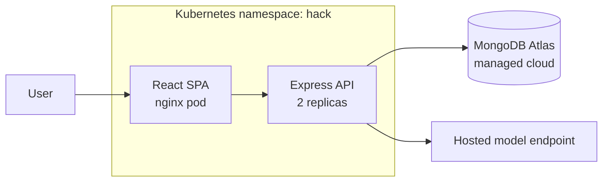

# Cloud, in layers (never bet the demo on it)

**Target 25 minutes.** The rule that governs everything here: **the demo runs locally; the cloud is
evidence, not the demo path.** Venue WiFi dies, and "approved WiFi only" means no hotspot rescue.
A team demoing from localhost with a cloud URL as proof scores well. A team whose demo *is* a cloud
URL and the WiFi drops scores zero on technical execution.

Do these in order and stop wherever time runs out — each layer is independently worth points.

## Layer 1 — Managed cloud database (5 min, free, no card) ✅ do this always

MongoDB Atlas M0 free tier is real managed cloud infrastructure.

1. atlas.mongodb.com → free M0 cluster, nearest region.
2. Network Access → add `0.0.0.0/0` (hackathon only — say out loud that production would be a
   VPC peering or an IP allowlist; naming the tradeoff earns marks).
3. Database Access → create a user, copy the connection string.
4. Put it in `.env` as `MONGODB_URI`. **Never commit it.** Confirm `.env` is gitignored.

Claim it as: *"Managed cloud Postgres-equivalent — we don't run our own database, we consume a
managed service, so failover and backups aren't our problem."*

**If the idea needs retrieval, use Atlas Vector Search** rather than adding a Python vector store.
Create a vector search index on your embeddings field in the Atlas UI, then query with a
`$vectorSearch` aggregation stage. This satisfies the organisers' "vector search" rail natively.

## Layer 2 — Images in a cloud registry (10 min, free, no card) ✅ do this always

**`gh` CLI is NOT available** — this network resets large GitHub release downloads (verified
9 Sep 2026). Use a Personal Access Token from the browser instead; `gh` was only ever convenience.

1. github.com → Settings → Developer settings → Personal access tokens → **Tokens (classic)**
2. Generate new token, scopes: **`write:packages`** and **`read:packages`**
3. Copy it (shown once), then:

```bash
echo "YOUR_PAT" | docker login ghcr.io -u YOUR_GITHUB_USERNAME --password-stdin
docker tag hack-api:v1 ghcr.io/YOUR_USERNAME/hack-api:v1
docker push ghcr.io/YOUR_USERNAME/hack-api:v1
```

Package visibility defaults to private; make it public on the package page so a judge can pull it.

A public image URL a judge can pull is concrete cloud proof, and it takes three minutes.
Then flip the Kubernetes manifests to that image and re-apply — now the cluster pulls from a cloud
registry, which is genuinely how production works.

## Layer 3 — A live public URL (15 min, needs billing enabled) ⚠️ optional

**Ask at kickoff whether UPS is issuing cloud accounts** — their slide lists AWS, GCP and Azure. If
they hand you credits, use those; skip the personal-card problem entirely.

Easiest paths, in order:
- **Google Cloud Run** — `gcloud run deploy --source .` — one command, scales to zero.
- **Azure Container Apps** — `az containerapp up --source .`
- **Render / Railway** free tiers — no card, slower cold starts.

Set the same env vars as `.env`. Point it at the same Atlas cluster.

**Timebox this to 15 minutes.** If it is not working, stop and walk away — you already have layers 1
and 2. Do not let a cloud deploy eat the hour you needed for the demo rehearsal.

## Architecture diagram (do this regardless — 10 min, high value)

Draw.io and Mermaid are both on the approved-tools slide, so the organisers want a diagram. Put a
Mermaid block in the README and screenshot it for the demo:



## Verify before claiming any of it

- Atlas: the API reads and writes against the cloud URI with local Mongo **stopped**.
- GHCR: `docker pull` the pushed tag from a clean state and it works.
- Cloud URL: open it in a private browser window (proves it isn't a cached local session).

## Hand back

List exactly what is live and where, and confirm the **local** demo path still runs end to end.
