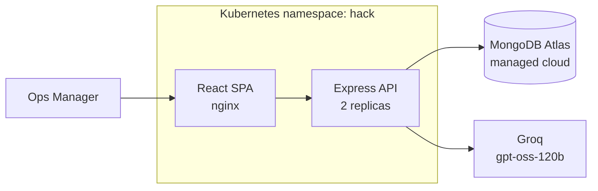

# OpsPulse

**Logistics Operations Excellence through Predictive Analytics and Resource Optimization**
UPS Graduate Hiring 2026 Hackathon · Use Case `2026 GH-GHS-01`

Operations leaders cannot answer three questions: *how much work is coming, how many people
does that need, and where are my people in the wrong place?* OpsPulse answers all three from
one pipeline.

## The insight

The brief lists four solution modules. They are not four projects - they are one pipeline
with four views:

```
historical volumes -> FORECAST -> workload hours -> REQUIRED HEADCOUNT
     -> compare vs rostered -> UTILISATION GAPS -> REDISTRIBUTION PLAN
```

| Brief module | Pipeline stage |
|---|---|
| Volume Forecasting | steps 1-2 |
| Smart Workforce Planning | steps 3-4 |
| Operations Efficiency Dashboard | measurement layer over the whole chain |
| Resource Optimization Engine | steps 5-6 |

## OEI - the measurable yardstick

The brief's first challenge is *"lack of a measurable yardstick to evaluate operational
efficiency."* So we built one and named it.

```
OEI = 100 x ( 0.5 x (actual units-per-person-hour / engineered standard)
            + 0.3 x utilisation
            + 0.2 x on-time throughput )
```

Always shown decomposed, so it can be argued with rather than trusted blindly.

## Aggregate by design

Page 2 of the brief: *"not intended to measure or evaluate individual employee productivity."*
There is no employee entity anywhere in the schema. Every metric aggregates at site,
function and shift level. This is enforced by the data model, not by policy.

## Results (synthetic dataset, 4 hubs, 120 days)

- **Forecast accuracy:** 6.7-12.4% MAPE across all 12 series, beating both a naive and a
  seasonal-naive baseline everywhere. Backtested on a hidden 14-day holdout.
- **Reclaimable capacity:** ~2,968 person-hours per week across four hubs by redistribution
  alone, with zero hiring.
- **Chennai hub:** 174 rostered against 176 required - broadly balanced - yet outbound runs
  at 114% utilisation while inbound sits at 65%. The problem is distribution, not headcount.

## Architecture



**Engine functions are pure** - `api/src/engine/*.js` take data and return data, no database
calls, so they are directly testable and the API layer stays thin.

## Stack

React + Vite · Express · MongoDB Atlas · Zod + Mongoose validation · Docker · Kubernetes · Groq

## Guardrails

- **Validation twice:** Zod at the API edge, Mongoose schema constraints at the data layer
- **NoSQL injection** blocked by `express-mongo-sanitize` plus strict Zod typing
- `helmet` security headers · explicit CORS origin · rate limiting · 100kb payload cap
- **Authorisation enforced server-side** by role; identity is stubbed, permissions are real
- No secrets in the repo or images - injected as environment variables / Kubernetes Secrets
- Containers run as a non-root user
- LLM input is delimited and treated as data; output is type-checked, length-capped, and
  falls back to a deterministic template on timeout

## Run it

```bash
# API
cd api && npm install && npm run seed && npm start     # :8000

# Web
cd web && npm install && npm run dev                   # :5173
```

`api/.env` needs `MONGODB_URI` and optionally `GROQ_API_KEY` (see `.env.example`).

## API

```
GET  /api/health
GET  /api/meta
GET  /api/sites
GET  /api/kpis?site=MAA&days=30
GET  /api/forecast?site=MAA&function=outbound&horizon=14
GET  /api/workforce-plan?site=MAA&scenario=1.0
GET  /api/optimize?site=MAA&scenario=1.0
GET  /api/overview?site=MAA&scenario=1.0          # powers the whole dashboard
POST /api/explain                                  # AI shift briefing
POST /api/admin/reset-demo                         # admin role only
```

## Honest limits

Single-node Kubernetes cluster; production would use a managed control plane, an Ingress with
TLS, HPA, and a real secret store. Data is synthetic. Forecasting uses seasonal decomposition
with Holt's linear trend rather than a trained model - **120 days of history does not justify
one**, and an unexplainable model is worse than a slightly less accurate explainable one when
a manager has to defend a staffing decision.
